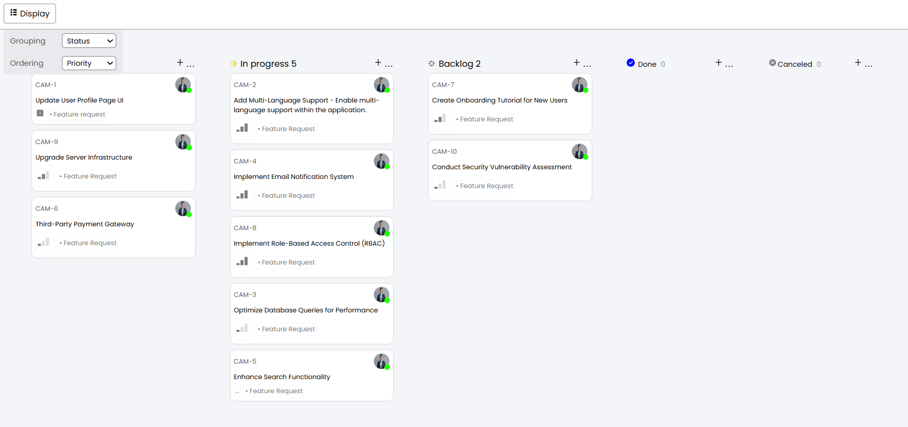

# Quicksell-Frontend-assignment

## About Project
Develop a React-based Kanban-board app that interfaces with the provided API by Quicksell. Users gain the ability to group tickets dynamically by status, user, or priority, and sort them based on priority or title. Priority levels encompass Urgent, High, Medium, Low, and No priority, mapped to values 4, 3, 2, 1, and 0

## Project View

<kbd></kbd>

<kbd></kbd>

<kbd></kbd>
